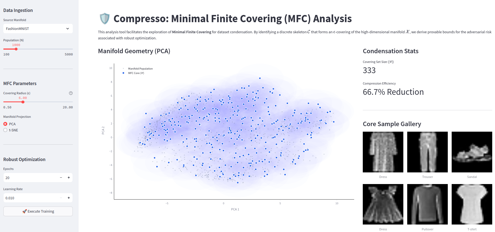

# Compresso

Powered by

## **General Description**
Compresso functions as an analytical instrument designed to operationalize Minimal Finite Covering (MFC) as a rigorous mathematical framework for dataset condensation. Unlike conventional dataset distillation techniques that often prioritize empirical accuracy at the expense of adversarial stability, this tool enforces a robustness-aware methodology by identifying a discrete skeleton that constitutes an epsilon-covering of the high-dimensional data manifold. By focusing on the geometric properties of the data distribution, Compresso ensures that models trained on the resulting condensed subset optimize a provable lower bound of the generalized adversarial loss, thereby providing theoretical guarantees that are frequently absent in heuristic condensation methods.

## **Related Compliance Aspects**
The software adheres to rigorous theoretical standards regarding adversarial robustness and manifold approximation. 

- It ensures that the data coresets preserve the geometric integrity of the original high-dimensional distribution within a specified covering radius. 
- Can be coupled with adversarial robustness guarantees

## **Main Goal/Functionalities**
The primary objective of Compresso is to facilitate the computation and visualization of robust dataset condensation through a greedy set-cover approximation algorithm. It enables the ingestion of standard benchmarks or proprietary datasets and performs computations in the native high-dimensional space to derive the Minimal Finite Covering. The tool provides functionalities for adjusting the covering radius to observe phase transitions between dense populations and sparse skeletal representations. Additionally, it offers manifold visualization capabilities using linear PCA and non-linear t-SNE projections to overlay the original distribution with selected anchors. An integrated training session allows researchers to execute robust optimization sequences on the condensed set, offering real-time feedback on convergence and compression efficiency.

## **Architecture**
The system architecture integrates a Python-based computational backend with an interactive frontend. The core logic relies on a greedy set-cover approximation algorithm that processes input data tensors to identify the optimal set of covering anchors. This computational layer interfaces with a visualization engine utilizing Scikit-learn for manifold projection and Plotly for geometric rendering. The data ingestion module utilizes PyTorch and Torchvision to handle both standard datasets and local directory structures. The entire pipeline is orchestrated through a Streamlit application, which manages the user interaction flow from data selection and parameter tuning to real-time monitoring of the robust optimization process.

## **Screenshots**

  

## **Commercial Information**
The software is developed and maintained by UCPH and is distributed as an Open Source project under the MIT License.

## **Expected KPIs**
The evaluation framework quantifies the algorithmic success in balancing dataset sparsity with model fidelity. The specific performance benchmarks and optimization targets are detailed below:

| Optimization Objective | | Target Benchmark |
| :--- | :--- | :--- |
| Trade-off between efficiency (data budget), performance (ex: accuracy), and robustness (adversarial perturbation)	| Accuracy, efficiency (resource consumption), and robustness (adversarial accuracy)	| Reduction in resource consumption by 50% with <5% drop in robust accuracy |

## **Related Project Links**
The source code and documentation are hosted on the Compresso GitHub repository at https://github.com/saintslab/compresso.

## **How To Install**
Deployment of Compresso on a local system requires a Python 3.8+ environment equipped with standard scientific computing libraries. The necessary dependencies, including Streamlit, PyTorch, Torchvision, Scikit-learn, Plotly, Pandas, NumPy, and Pillow, can be installed via the Python package manager.

## **How To Use**
The application is launched by executing the Streamlit run command targeting the main script in the project terminal. Upon initialization, the interface allows for the selection of datasets and the configuration of the covering radius parameter. Users can then proceed to visualize the high-dimensional covering and initiate the integrated PyTorch training session to evaluate the robustness of the condensed dataset. Detailed logs within the terminal console provide real-time metrics regarding the manifold covering progress and final compression statistics.

## **Other Information**
n/a

## **OpenAPI Specification**
n/a

## **Additional Links**
This repository implements the minimal finite covering problem and its application, and is the official source code for paper "[Is Adversarial Training with Compressed Datasets Effective?](https://arxiv.org/abs/2402.05675)" (Chen & Selvan. 2025).

## Compresso -> POT 
 
Pareto Optimal Tradeoff (POT) is a tool built on top of the Compresso toolset that add features to consider also fairness, and identify solutions that balance fairness, robustness, and quality requirements in the dataset. [Ongoing research](https://arxiv.org/abs/2602.23192) is steering methodology development to operationalize resource efficiency (by quantization or pruning) while maintaining algorithmic fairness of models.
~                                                 
## **Expected KPIs for POT**
The evaluation framework quantifies the trade-off between efficiency, performance and fairness of models.

| Optimization Objective | | Target Benchmark |
| :--- | :--- | :--- |
|Trade-off between efficiency (model capacity), performance (ex: accuracy), and fairness| Accuracy, efficiency (resource consumption), and fairness	| Reduction in resource consumption by 50% with < 10% drop in fairness metrics like accuracy gap|

